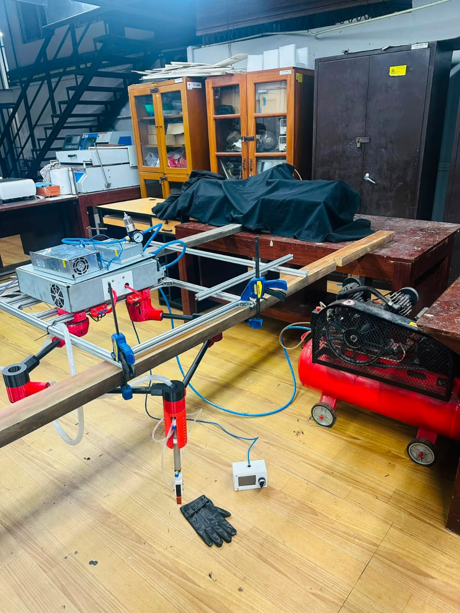
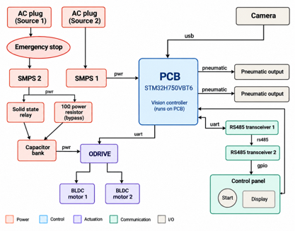
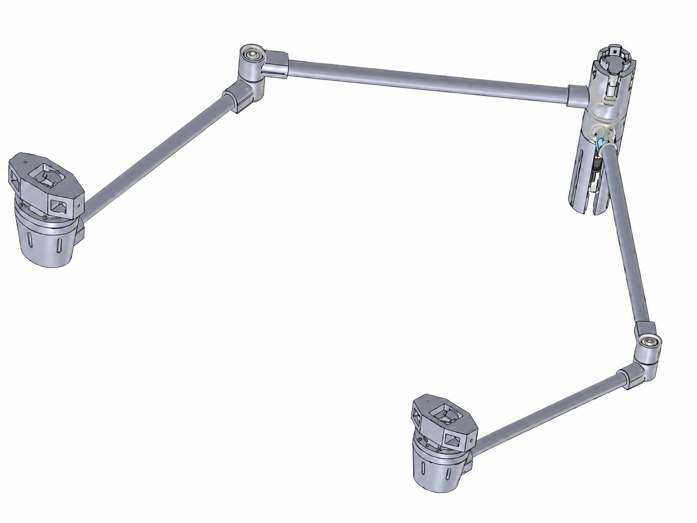
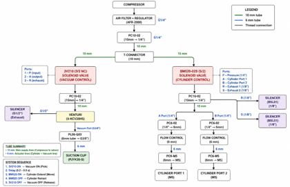
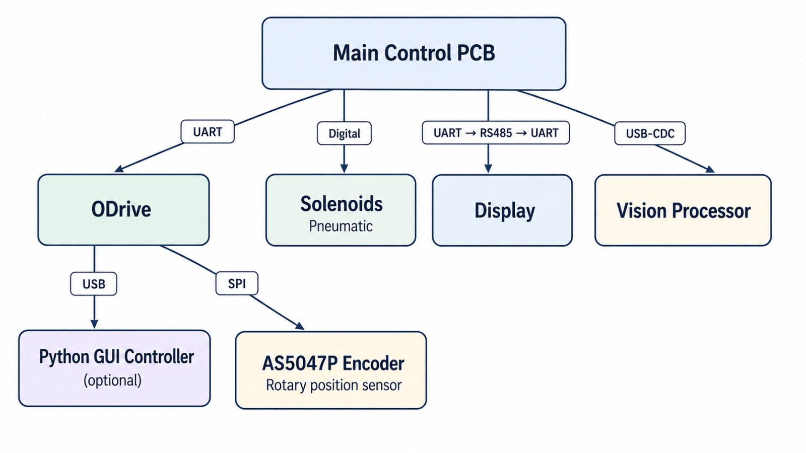
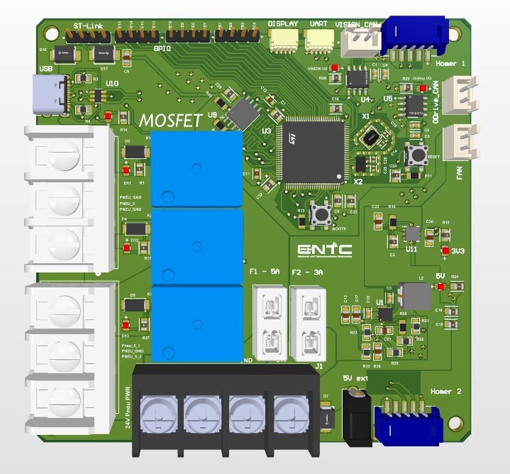
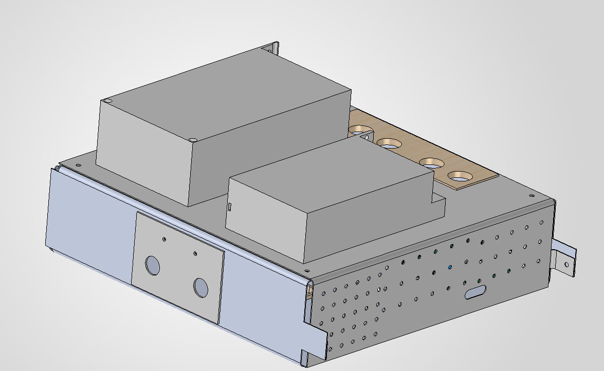
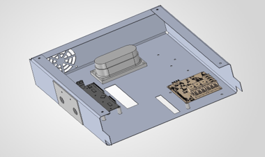
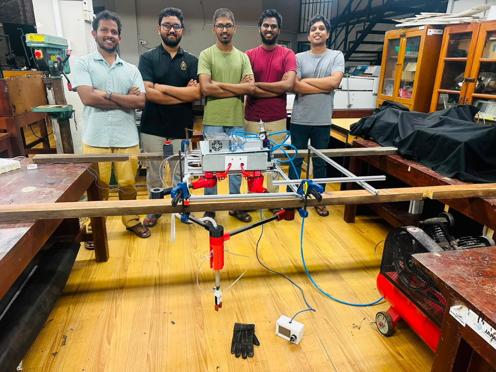

# 🧤 GRIP - Glove Rejection and Inspection Process

<div align="center">


[](.)
[](.)
[](.)
[](.)
[](.)
[](.)

**Automated Computer Vision + SCARA Robotic Quality Control System**  
*Real-time glove orientation inspection, uncertainty rejection, and belt-synchronised robotic removal*




</div>

---

## 📌 Project Summary


**GRIP**, short for **Glove Rejection and Inspection Process**, is an engineering prototype for automating quality control in a nitrile glove manufacturing conveyor line. The system uses a camera-based computer vision model to identify gloves that should pass, be rejected, or be sent to manual inspection. A downstream **parallel SCARA robot** with a pneumatic/vacuum end-effector is planned to remove rejected gloves from the moving belt.

The current MVP focuses on **wrong-hand glove detection** first:

```text
Expected glove on lane  → left glove
Wrong-hand glove        → right glove
Unsafe/unclear image    → manual/recheck
```

The final target system is:

```text
Factory conveyor
↓
Top-down camera
↓
Computer vision model
↓
Decision logic: PASS / REJECT / MANUAL
↓
Tracking + belt timing
↓
STM32H7 controller
↓
Parallel SCARA robot + pneumatic/vacuum gripper
↓
Reject/manual inspection bin
```

---

## 🎯 Problem Being Solved

| Problem | Production impact |
|---|---|
| Left/right glove mix-up | Packaging errors and customer complaints |
| Crumpled or unclear gloves | Risk of unsafe automatic classification |
| Label defects | Smudged, missing, or unreadable printed information |
| Manual inspection | Fatigue, inconsistency, and missed defects |
| High belt speed | Hard to inspect every glove accurately |
| No automatic logging | Difficult to track defect patterns and improve the process |

The project does **not** try to force a prediction when the glove is visually unsafe. The current industrial logic is:

```text
Clear LEFT  → PASS
Clear RIGHT → REJECT / PICK
UNCLEAR     → MANUAL / RECHECK
```

For the MVP, this is safer than trying to achieve unrealistic 100% classification from blurred or crumpled frames.

---

## 🏗 Complete System Architecture

<div align="center">
  
</div>


## 🤖 Mechanical and Robotic System

The robot mechanism selected for the project is a **parallel SCARA-style mechanism**. The main reason for selecting this mechanism is that the moving mass can be kept lower compared to a conventional serial SCARA design. This is useful for fast, repetitive pick-and-place operations on lightweight products such as gloves.

### Why parallel SCARA?

| Reason | Benefit |
|---|---|
| Motors remain closer to the base | Lower moving mass |
| Better load distribution | More stable high-speed motion |
| Suitable planar workspace | Matches conveyor pick-and-place task |
| Simpler than delta robot for this application | Easier mechanical design and control |
| Good for lightweight repetitive tasks | Suitable for glove rejection |

<div align="center">
  
</div>

### Planned end-effector

The end-effector is planned as a **pneumatic/vacuum gripper** because gloves are soft, flexible, and difficult to grip mechanically with a rigid claw.




```text
Approach glove
↓
Lower vacuum cup / soft gripper
↓
Activate vacuum
↓
Lift glove
↓
Move to reject/manual bin
↓
Release vacuum
↓
Return to standby
```

---

## 🔌 Electrical and Control System

The real-time control layer is planned around an **STM32H7 microcontroller**. The reason for separating the control system from the vision system is that computer vision inference is non-deterministic compared to motor and encoder control. The PC/Jetson handles heavy vision processing, while the STM32 handles timing-critical robot control.

 <p align = "center">
  
  
  
 </p>
 
---

## ⚙️ Structural and enclosure Design

The enclosure in which the electrial system was enclosed in was designed for sheet metal manufacturing constraints and manufactured locally.

<p align = "center">
  
  
  
 </p>
 
### Planned control responsibilities

| Component | Responsibility |
|---|---|
| Vision processor | Camera capture, model inference, decision logic, command generation |
| STM32H7 | Timing, central communication, control loops(if employed) |
| Odrive | Main 3 control loop running |
| SCARA motor controllers | Robot joint actuation |
| Solenoid valves | Pneumatic/vacuum gripper control |
| Status display/LEDs | Operator feedback |


---

### Team MOSFET 2.0 · ENTC, University of Moratuwa · 2026

<div align="center">
  
</div>


The project was developed by;
  1. Sithum Peiris [@angstrom10](https://github.com/angstrom10)
  2. Lakindu Gunasekara [@LGsekara1](https://github.com/angstrom10)
  3. Hiruna Kariyawasam [@HirunaK](https://github.com/HirunaK)
  4. Chathuka Elapatha [@Chippy1520](https://github.com/Chippy1520)
  5. Abdul Rahman [@abdul-rahman-bme](https://github.com/abdul-rahman-bme)


*GRIP - Glove Rejection and Inspection Process*


