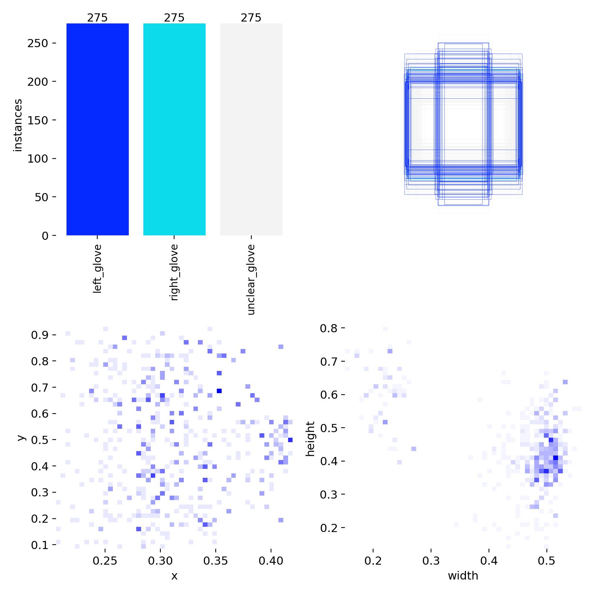
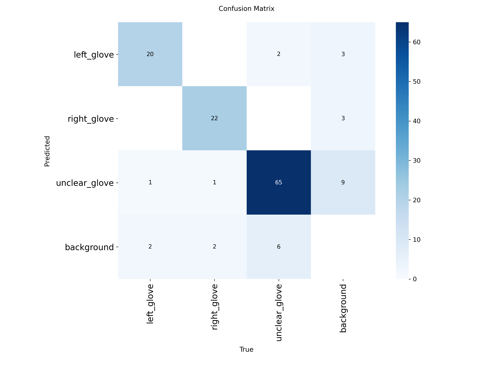
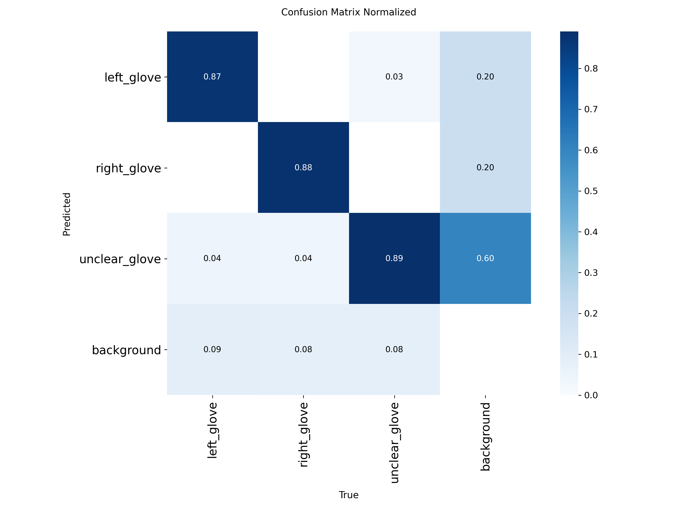
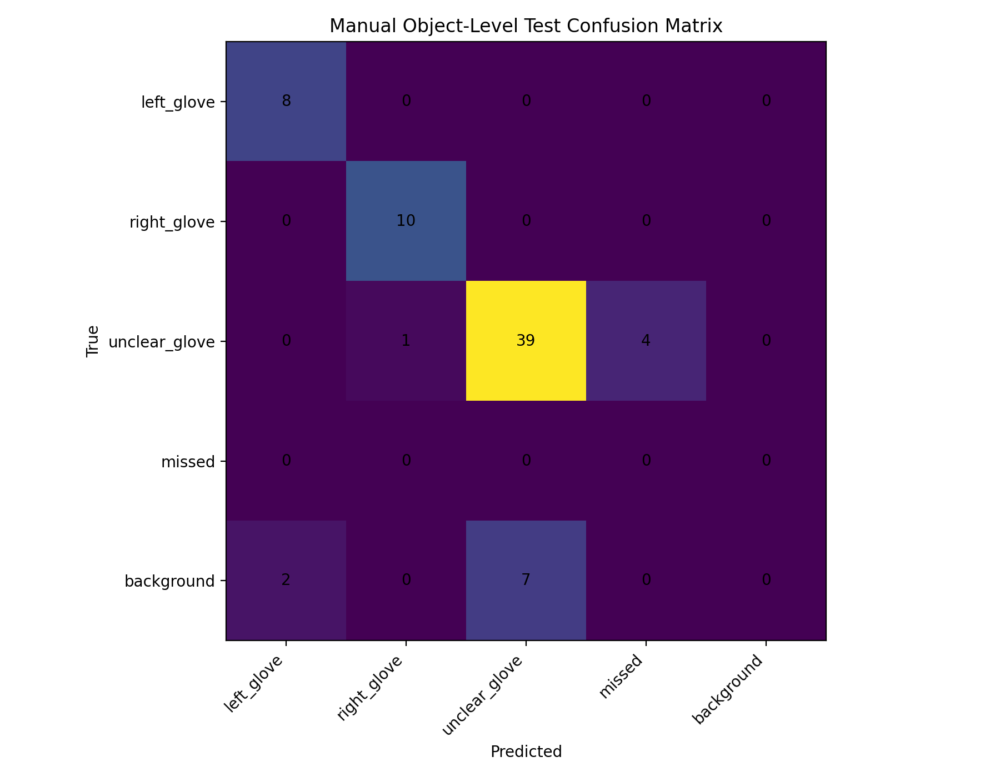
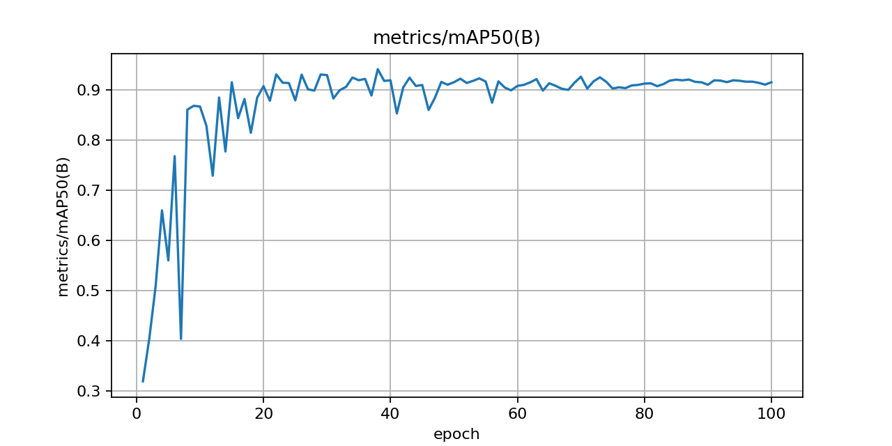
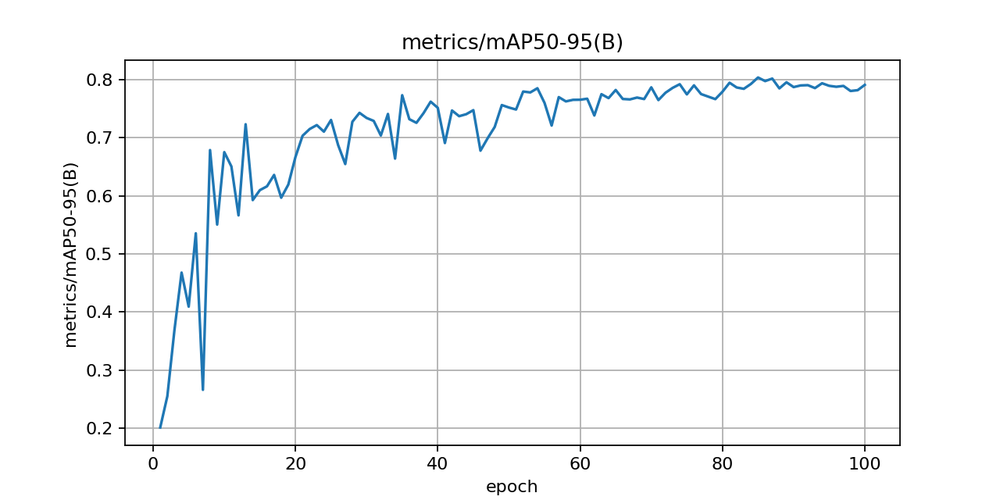
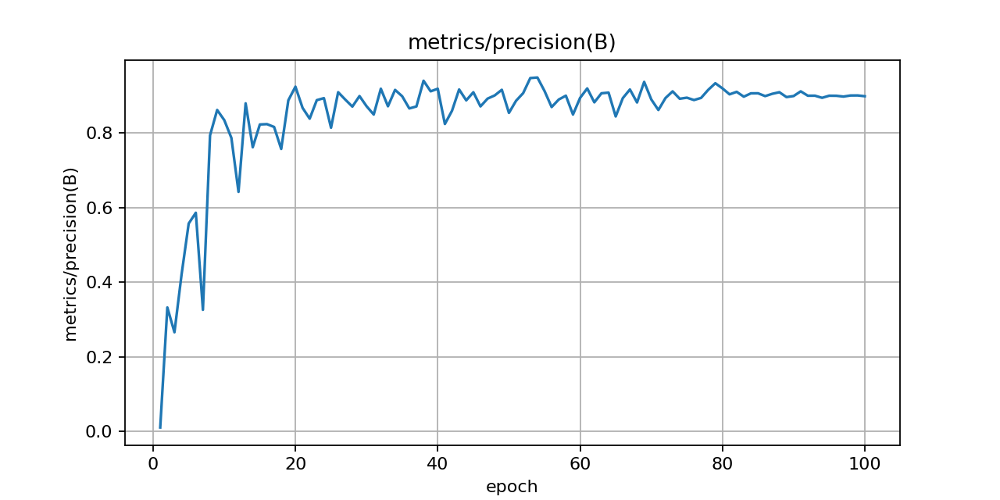
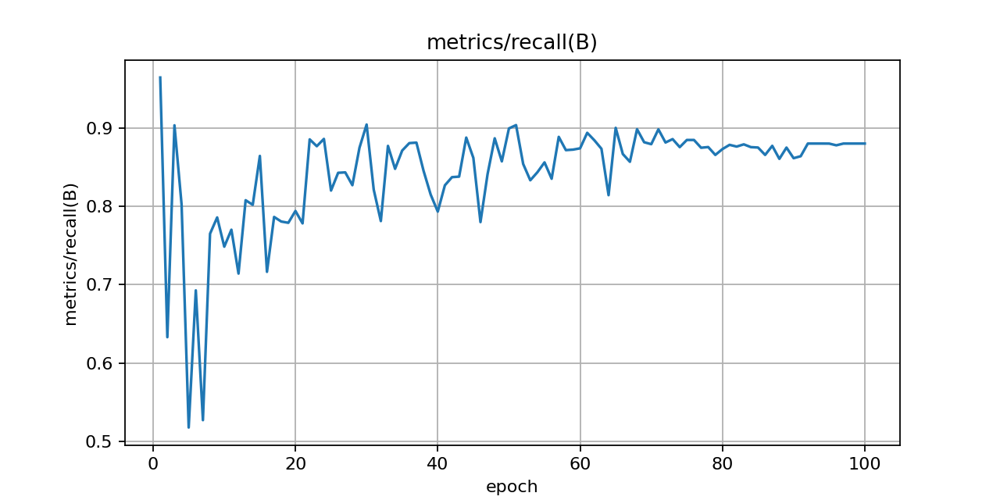

# GRIP Left / Right / Unclear YOLO Detect Prototype

<p align="center">
  <b>Computer Vision Prototype for Conveyor-Belt Glove Handedness Inspection</b><br>
  YOLO Detect model trained to classify gloves as <code>left_glove</code>, <code>right_glove</code>, or <code>unclear_glove</code>.
</p>

<p align="center">
  
  
  
  
</p>

---

## 1. Purpose

This subfolder contains the first urgent prototype model for the GRIP conveyor-belt glove inspection system.

The goal of this prototype is to test whether the current factory camera frames can support a practical **3-class detection model**:

| Class ID | Class Name | Meaning |
|---:|---|---|
| 0 | `left_glove` | Visually clear left glove |
| 1 | `right_glove` | Visually clear right glove |
| 2 | `unclear_glove` | Crumpled, blurred, partial, folded, or unsafe-to-decide glove |

For the factory use case, the most important failure is:

```text
true right_glove predicted as left_glove
```

That error is dangerous because a wrong-hand glove may pass as a good glove.

---

## 2. Dataset Summary

The original annotated dataset was split using a 70 / 20 / 10 split.

| Split | Images |
|---|---:|
| Train | 825 |
| Validation | 121 |
| Test | 62 |

Original annotation counts before balancing were approximately:

| Class | Count |
|---|---:|
| `left_glove` | 117 |
| `right_glove` | 114 |
| `unclear_glove` / crumpled | 377 |

The training set was balanced during preprocessing because the `unclear_glove` class was much larger than the left/right classes.

---

## 3. Training Configuration

| Item | Value |
|---|---|
| Framework | Ultralytics YOLO |
| Task | Detection |
| Base model | `yolo11n.pt` |
| Image size | `640` |
| Max epochs | `100` |
| Early stopping patience | `20` |
| Horizontal flip | Disabled |
| Reason for disabling horizontal flip | Horizontal flipping changes glove handedness and can poison LEFT/RIGHT labels |
| Best model checkpoint | `best.pt` |
| Last epoch checkpoint | `last.pt` |

Training command concept:

```bash
yolo task=detect mode=train model=yolo11n.pt data=data.yaml imgsz=640 epochs=100 patience=20 fliplr=0.0
```

---

## 4. Result Files in This Folder

| File | Description |
|---|---|
| `best.pt` | Best validation checkpoint. Use this for testing and deployment experiments. |
| `last.pt` | Final epoch checkpoint. Useful for debugging, but usually not the model to deploy. |
| `data.yaml` | Dataset class names and split paths used for training. |
| `results.csv` | Epoch-by-epoch training and validation metrics. |
| `confusion_matrix.png` | Validation confusion matrix generated by YOLO. |
| `confusion_matrix_normalized.png` | Normalized validation confusion matrix. |
| `manual_test_predictions.csv` | Object-level predictions on the held-out test set. |
| `manual_test_confusion_matrix.csv` | Manual test confusion matrix values. |
| `manual_test_confusion_matrix.png` | Manual object-level test confusion matrix. |
| `manual_test_classification_report.csv` | Precision, recall, and F1-score per class. |
| `metrics_mAP50(B).png` | mAP50 curve over epochs. |
| `metrics_mAP50-95(B).png` | mAP50-95 curve over epochs. |
| `metrics_precision(B).png` | Precision curve over epochs. |
| `metrics_recall(B).png` | Recall curve over epochs. |
| `labels.jpg` | Dataset label distribution / label visualization. |

---

## 5. Main Visual Results

### 5.1 Dataset Label Distribution

<p align="center">
  
</p>

---

### 5.2 Validation Confusion Matrix

<p align="center">
  
</p>

---

### 5.3 Normalized Validation Confusion Matrix

<p align="center">
  
</p>

---

### 5.4 Manual Test Confusion Matrix

This is the most important plot for checking the final held-out test behavior.

<p align="center">
  
</p>

---

## 6. Training Curves

### 6.1 mAP50

<p align="center">
  
</p>

---

### 6.2 mAP50-95

<p align="center">
  
</p>

---

### 6.3 Precision

<p align="center">
  
</p>

---

### 6.4 Recall

<p align="center">
  
</p>

---

## 7. How to Interpret the Result

Do not judge this prototype only by overall accuracy.

For this industrial problem, evaluate errors in this priority order:

| Priority | Error Type | Meaning |
|---:|---|---|
| 1 | `right_glove → left_glove` | Dangerous. Wrong glove may pass as good. |
| 2 | `unclear_glove → left_glove/right_glove` | Unsafe forced decision on unclear image. |
| 3 | `left_glove → right_glove` | False reject. Bad for throughput but safer than passing a wrong glove. |
| 4 | `left_glove/right_glove → unclear_glove` | Manual workload increases, but factory safety improves. |

Recommended first acceptance target:

```text
right_glove predicted as left_glove = 0 or near 0 on the held-out test set
```

---

## 8. How to Run Inference on Images

Install dependencies:

```bash
pip install ultralytics opencv-python
```

Run prediction:

```bash
yolo task=detect mode=predict model=best.pt source=path/to/test_images conf=0.15 imgsz=960 save=True
```

For a stricter threshold:

```bash
yolo task=detect mode=predict model=best.pt source=path/to/test_images conf=0.35 imgsz=960 save=True
```

For debugging missed detections, temporarily lower confidence:

```bash
yolo task=detect mode=predict model=best.pt source=path/to/test_images conf=0.05 imgsz=960 save=True
```

---

## 9. How to Run Inference on Video

Example:

```bash
yolo task=detect mode=predict model=best.pt source=mixed_dataset_video.mp4 conf=0.10 imgsz=960 save=True
```

Recommended first video-test settings:

| Setting | Value |
|---|---:|
| Confidence | `0.05` to `0.15` for debugging |
| Image size | `960` |
| Save predictions | `True` |
| Check first | Whether boxes appear consistently |

If no detections appear at `conf=0.05`, check these before retraining:

1. Confirm the correct `best.pt` is loaded.
2. Confirm `model.task` is `detect`, not `pose`.
3. Confirm `model.names` are `left_glove`, `right_glove`, and `unclear_glove`.
4. Compare the mixed video visually against the training data.
5. Check whether the test video has stronger blur, different lighting, different glove color, or different scale.

---

## 10. Export for Deployment

Export to ONNX:

```bash
yolo export model=best.pt format=onnx imgsz=640 simplify=True
```

For Jetson deployment, export to TensorRT engine on the Jetson device:

```bash
yolo export model=best.pt format=engine imgsz=640 half=True
```

---

## 11. Current Limitations

This model is a prototype sanity test, not the final production model.

Known limitations:

1. The dataset is small.
2. Many frames come from videos, so nearby frames may look very similar.
3. Motion blur is still visible.
4. Some left/right labels may be visually weak because glove fingers or thumb are hidden.
5. `unclear_glove` has more samples than left/right.
6. The model may fail on new lighting, camera height, glove color, or conveyor background.

---

## 12. Next Improvements

Recommended next steps:

1. Collect a separate mixed test video that was never used during training.
2. Run `best.pt` on that video using low confidence first.
3. Save all false predictions.
4. Add hard failures to the dataset.
5. Retrain with more balanced left/right/unclear samples.
6. Later test a two-stage system:
   - YOLO detects glove.
   - Cropped classifier decides `LEFT / RIGHT / UNCLEAR`.

The long-term production system should use:

```text
YOLO glove detector
→ tracking
→ crop/mask
→ LEFT/RIGHT/UNCLEAR classifier
→ reject threshold
→ manual bin for uncertain cases
```

---

## 13. GitHub Commit Suggestion

Suggested folder:

```text
1st July Workflow/
```

Suggested commit:

```bash
git add "1st July Workflow"
git commit -m "Add GRIP left-right-unclear YOLO detect prototype results"
git push
```

---

## 14. Safety Note

For GRIP, the target should not be “force every glove into LEFT or RIGHT.”

The safer factory rule is:

```text
Clear evidence → automatic decision
Low confidence / blurred / folded / crumpled → unclear_glove → manual/recheck bin
```

This reduces the chance of a wrong-hand glove passing through the left-glove lane.
